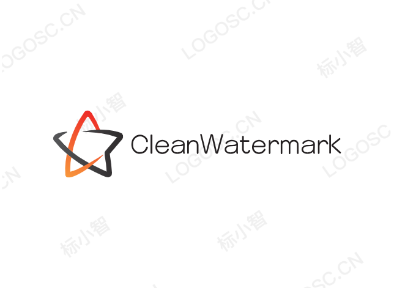

# CleanWatermark
像素级去除LOGO水印

## Usage
`Step1:`查看水印的颜色：[http://www.jiniannet.com/page/allcolor](http://www.jiniannet.com/page/allcolor)

`Step2:`更新水印颜色集：`watermark_color`

`Step3:`运行代码：`python clean_watermark.py`

## Preview
带水印的LOGO：

去除水印的LOGO：

